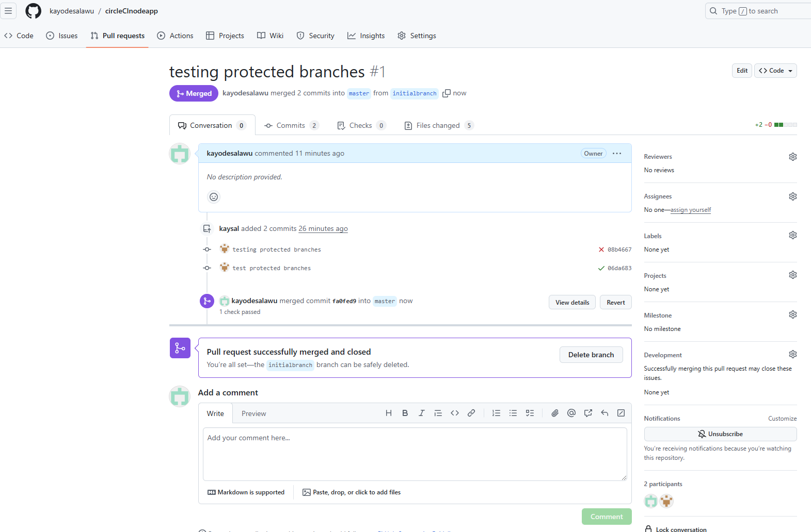

# Docker Node MongoDB Example

> Simple example of a dockerized Node/Mongo app

## Quick Start

```bash
# Run in Docker
docker-compose up
# use -d flag to run in background

# Tear down
docker-compose down

# To be able to edit files, add volume to compose file
volumes: ['./:/usr/src/app']

# To re-build
docker-compose build
```

# Test

1. Turn on master branch protection as show in files
- 
- 
- 

2. We can see that the master branch is protectedand the following command to push to master failed:

<details>

<summary>Push to protected branch failed</summary>

```bash
circleCInodeapp$ git add .
circleCInodeapp$ git status
On branch master
Your branch is up to date with 'origin/master'.

Changes to be committed:
  (use "git restore --staged <file>..." to unstage)
        new file:   Rulesets.pdf
        new file:   images/ruleset-1.png
        new file:   images/ruleset-2.png
        new file:   images/ruleset-3.png
        modified:   index.test.js

circleCInodeapp$ git commit -m "testing protected branches"
[master 08b4667] testing protected branches
 5 files changed, 1 insertion(+), 1 deletion(-)
 create mode 100644 Rulesets.pdf
 create mode 100644 images/ruleset-1.png
 create mode 100644 images/ruleset-2.png
 create mode 100644 images/ruleset-3.png
circleCInodeapp$ git push origin master
Enumerating objects: 10, done.
Counting objects: 100% (10/10), done.
Delta compression using up to 2 threads
Compressing objects: 100% (8/8), done.
Writing objects: 100% (8/8), 261.30 KiB | 15.37 MiB/s, done.
Total 8 (delta 2), reused 0 (delta 0), pack-reused 0
remote: Resolving deltas: 100% (2/2), completed with 2 local objects.
remote: error: GH013: Repository rule violations found for refs/heads/master.
remote: Review all repository rules at https://github.com/kayodesalawu/circleCInodeapp/rules?ref=refs%2Fheads%2Fmaster
remote:
remote: - Required status check "ci/circleci: build" is expected.
remote:
To https://github.com/kayodesalawu/circleCInodeapp.git
 ! [remote rejected] master -> master (push declined due to repository rule violations)
error: failed to push some refs to 'https://github.com/kayodesalawu/circleCInodeapp.git'
```

</details>
<p>

3. But we can push to a different branch

```bash
circleCInodeapp$ git push origin master:initialbranch
Enumerating objects: 10, done.
Counting objects: 100% (10/10), done.
Delta compression using up to 2 threads
Compressing objects: 100% (8/8), done.
Writing objects: 100% (8/8), 261.30 KiB | 15.37 MiB/s, done.
Total 8 (delta 2), reused 0 (delta 0), pack-reused 0
remote: Resolving deltas: 100% (2/2), completed with 2 local objects.
remote:
remote: Create a pull request for 'initialbranch' on GitHub by visiting:
remote:      https://github.com/kayodesalawu/circleCInodeapp/pull/new/initialbranch
remote:
To https://github.com/kayodesalawu/circleCInodeapp.git
 * [new branch]      master -> initialbranch
```

4. And then create a pull request and merging to master branch

- 

git push origin master:initialbranch
