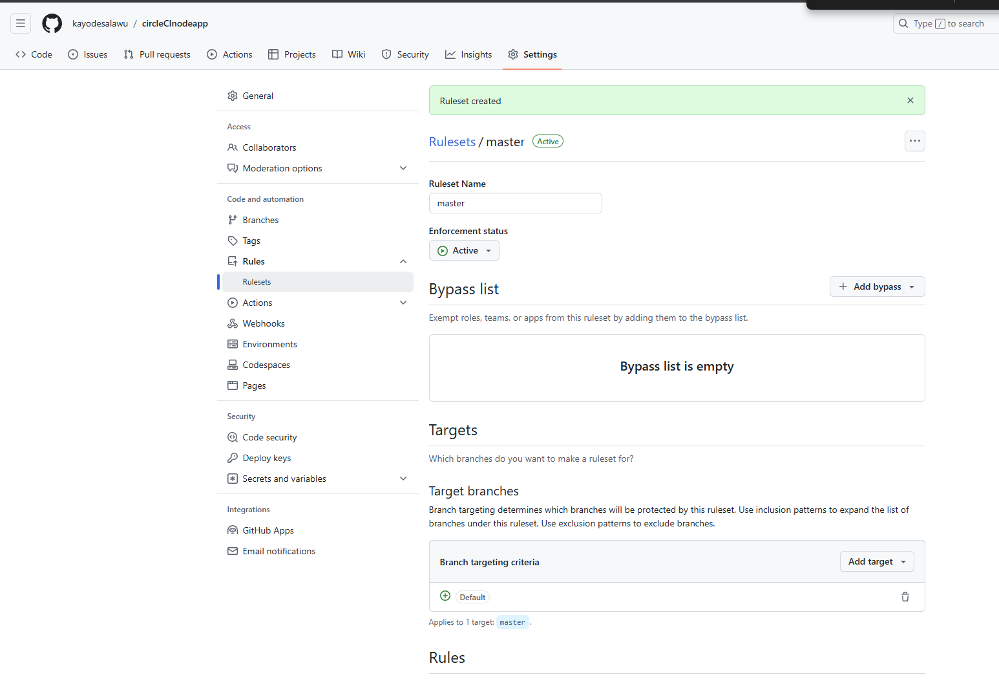
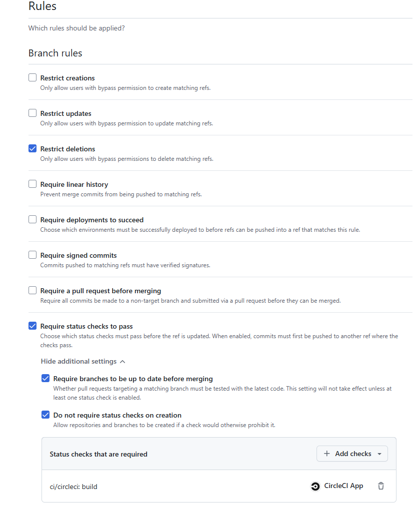
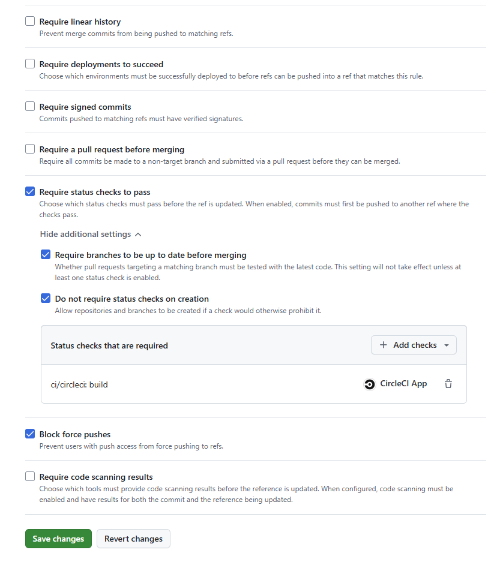
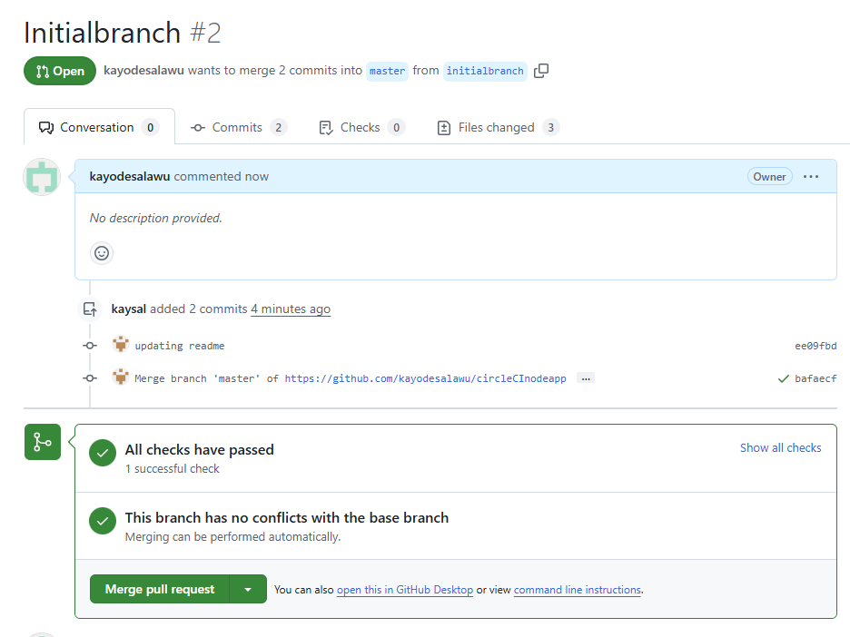
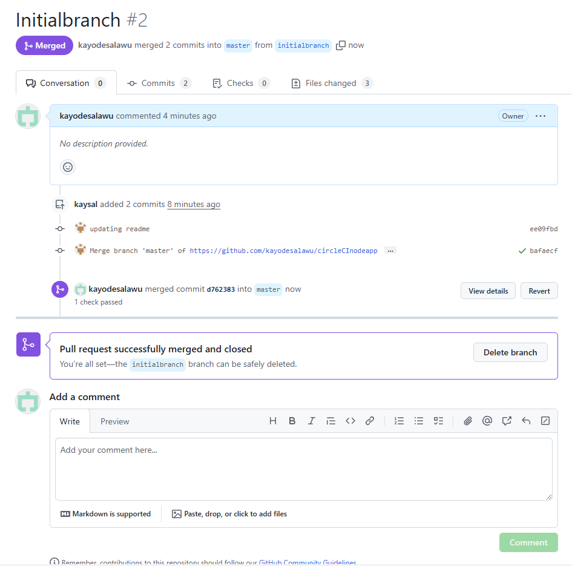

# Docker Node MongoDB Example

> Simple example of a dockerized Node/Mongo app

## Quick Start

```bash
# Run in Docker
docker-compose up
# use -d flag to run in background

# Tear down
docker-compose down

# To be able to edit files, add volume to compose file
volumes: ['./:/usr/src/app']

# To re-build
docker-compose build
```

# Test

1. Turn on master branch protection as show in files
- 
- 
- 

2. We can see that the master branch is protectedand the following command to push to master failed:

<details>

<summary>Push to protected branch failed</summary>

```bash
circleCInodeapp$ git add .
circleCInodeapp$ git commit -m "updating readme"
[master ee09fbd] updating readme
 3 files changed, 80 insertions(+), 3 deletions(-)
 create mode 100644 images/protected-master-branch-merge.png
 delete mode 100644 notes.sh
circleCInodeapp$ fetch
bash: fetch: command not found
circleCInodeapp$ git fetch
circleCInodeapp$ git push origin master
Enumerating objects: 9, done.
Counting objects: 100% (9/9), done.
Delta compression using up to 2 threads
Compressing objects: 100% (6/6), done.
Writing objects: 100% (6/6), 120.49 KiB | 15.06 MiB/s, done.
Total 6 (delta 2), reused 0 (delta 0), pack-reused 0
remote: Resolving deltas: 100% (2/2), completed with 1 local object.
remote: error: GH013: Repository rule violations found for refs/heads/master.
remote: Review all repository rules at https://github.com/kayodesalawu/circleCInodeapp/rules?ref=refs%2Fheads%2Fmaster
remote:
remote: - Required status check "ci/circleci: build" is expected.
remote:
To https://github.com/kayodesalawu/circleCInodeapp.git
 ! [remote rejected] master -> master (push declined due to repository rule violations)
error: failed to push some refs to 'https://github.com/kayodesalawu/circleCInodeapp.git'
```

</details>
<p>

1. But we can push to a different branch `initialbranch`

```bash
circleCInodeapp$ git push origin master:initialbranch
Enumerating objects: 9, done.
Counting objects: 100% (9/9), done.
Delta compression using up to 2 threads
Compressing objects: 100% (6/6), done.
Writing objects: 100% (6/6), 120.49 KiB | 15.06 MiB/s, done.
Total 6 (delta 2), reused 0 (delta 0), pack-reused 0
remote: Resolving deltas: 100% (2/2), completed with 1 local object.
To https://github.com/kayodesalawu/circleCInodeapp.git
   06da683..bafaecf  master -> initialbranch
```

4. CircleCI checks passed

- 

5. Merge `initialbranch` into `master` branch

- 

